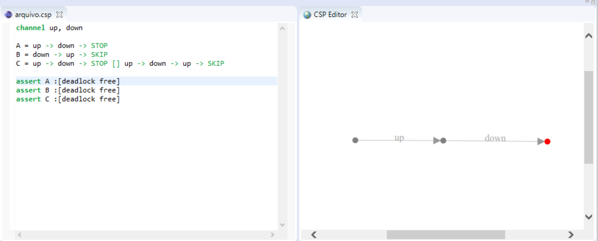
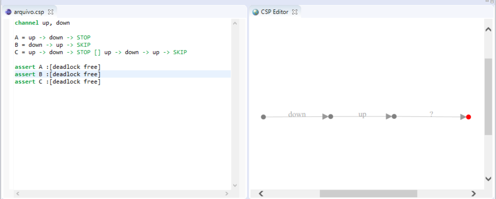

<h1 align="center">
    CSP Graphviz
</h1>

  
  

Animator for counterexamples generated from deadlock tests. This tests are made by FDR, the CSP refinement checker.
This application is part of the scientific initiation research _Integrating CSP with Programming Languages_. We can check the final report [here](https://drive.google.com/file/d/11Td0Bn5epJac_N3WQG3cAgN52Oq340Gi/view?usp=sharing).

## Getting Started

Clone the repository and run the application with a IDE with Java support (Eclipse or IntelliJ recommended).

### Prerequisites

Have Java installed on the machine and use an IDE.

### Demo

Visualization of a deadlock generated by the animator (on the right), based on the definition of a process A that leads to a terminal failure state (on the left):

As process B indicates leading to a successful terminal state (left side), the visualization of deadlock and failure cases is undefined by the animator (right side):

## Contributing

Make a pull request and make clear what changes have been made and which bugs persist. Do not introduce bugs, be proactive!

## Licenses

- **MIT License** - [_Ver detalhes_](./LICENSE.txt)
